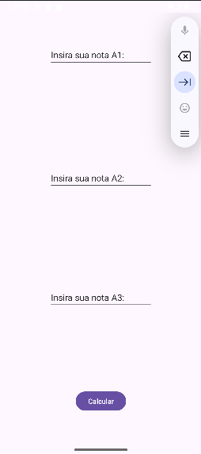
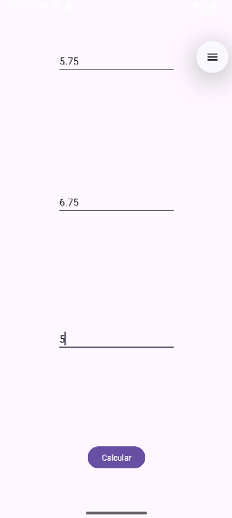

# 📱 Cálculo de Média (A1, A2, A3) – Aplicativo Android

Este é um projeto acadêmico desenvolvido em **Android Studio**, cujo objetivo é calcular a **média aritmética** de três notas: **A1**, **A2** e **A3**.
O projeto faz parte da disciplina **Programação para Dispositivos Móveis** e tem como propósito aplicar conceitos de desenvolvimento de aplicativos Android.

## 🎯 Objetivo do Projeto

O aplicativo solicita ao usuário as três notas, realiza o cálculo da média e exibe o resultado na tela.
Este trabalho tem como metas principais:

* Praticar **entrada de dados** em aplicativos Android.
* Utilizar **eventos de clique** para processar informações.
* Aplicar **cálculos matemáticos simples** em código Java.
* Desenvolver e testar uma **interface gráfica amigável**.

## 🛠️ Tecnologias Utilizadas
* **IDE**: Android Studio
* **Linguagem**: Java
* **SDK**: Android SDK
* **Layout**: XML

## Funcionalidades

 - ✅ Campos de entrada para notas A1, A2 e A3.
 - ✅ Botão para calcular a média.
 - ✅ Exibição do resultado na tela.
 - ✅ Interface simples e intuitiva.

## 📸 Capturas de Tela

### Tela Principal

### Inserção dos dados

### Resultado da primeira média

### Segunda Captura

### Inserção dos dados

### Resultado da segunda média

## 📝 Conclusão

Durante o desenvolvimento deste projeto, foi possível compreender o ciclo de vida de uma Activity,
o uso de componentes de interface como EditText e Button,
bem como a captura de eventos de clique para processar dados.
Além disso, foi reforçado o uso de lógica básica para cálculos simples e a importância de uma interface clara para o usuário.

## ‍🎓 Autor

Pedro Victor do Nascimento Thaumaturgo
Disciplina: Programação para Dispositivos Móveis

